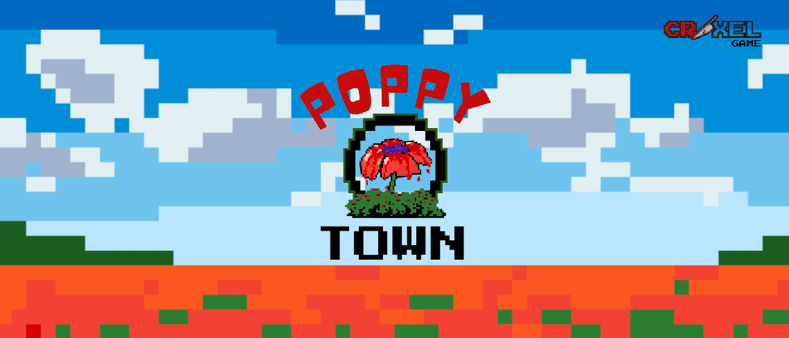

# DH2650 Individual DevLog 

Welcome to Natalia Sempere's DevLog!   
This is an individual development log for the course **DH2650 Computer Game Design** at KTH.  

🥀[Link to GitHub project](https://github.com/HyperDecahedron/PoppyTown)

🥀[Link to the game, play in your browser!](https://hyper-nat.itch.io/poppy-town)

## 27/03/2025 - Initial concepts

  - The first steps of the project have begun. We have decided to create a 2D pixel art game with a top-down perspective and a story-driven approach.
  - I have used a graphics tablet for the first time in my life and have drawn an initial character concept, in both plain 2D and pixel art. The three stages represent the evolution we plan to implement in the game.
    
  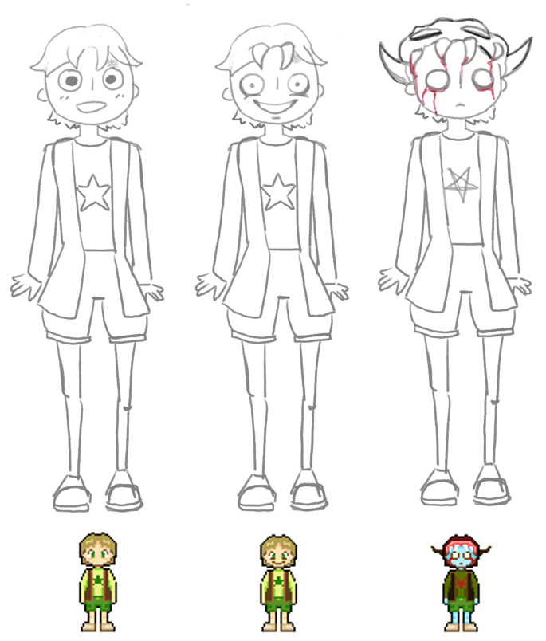

## 04/04/2025 - Time and Sun animation

- 🧱 **Tile Map Investigation**
  - Researched how to generate tile maps in Unity.
  - Compared tile sizes (16px vs 32px).
  - **Decision:** Using 32px tiles for more details.

- ⏰ **Time Mechanic**
  - Implemented in-game time system.
  - 1 in-game day = 20 real-life minutes (configurable).

- 🌞🌙 **Day/Night Animation**
  - Drew and implemented an animation that displays a sun or moon based on the in-game time.

- 👻 **Creepiness Mechanic**
  - Implemented a "creepiness" level that updates every night at 03:00 in game time.

   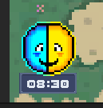
   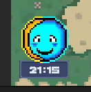
   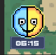
   

## 06/04/2025 - Postprocessing test

- 🎩 **Postprocessing progression**
  - Added postprocessing with URP and Global Volumes to the project. I'm using Unity 2022.3 and this was a nightmare that lasted the whole morning. Finally solved the problem with [this tutorial](https://www.youtube.com/watch?v=YDj-P1r-3ms&t=2s).
  - The postprocessing changes automatically according to the level of creepiness (from 1 to 3).
 
  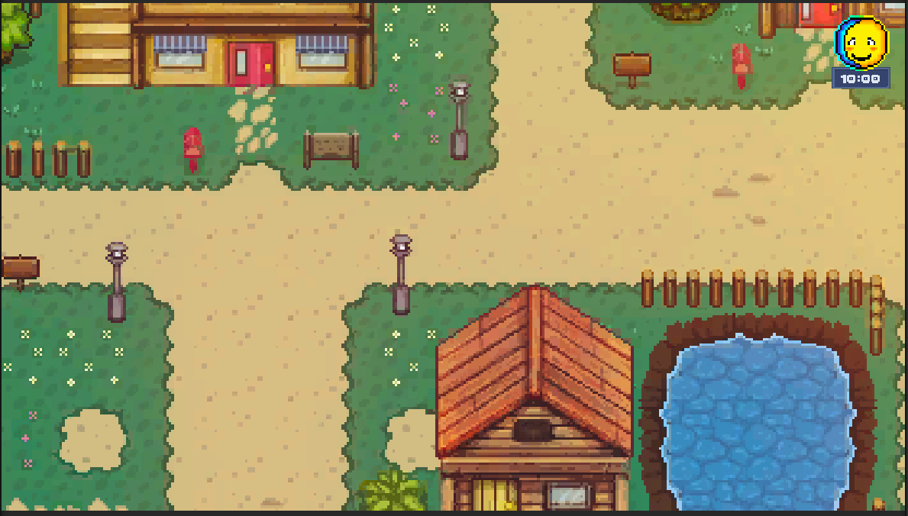
   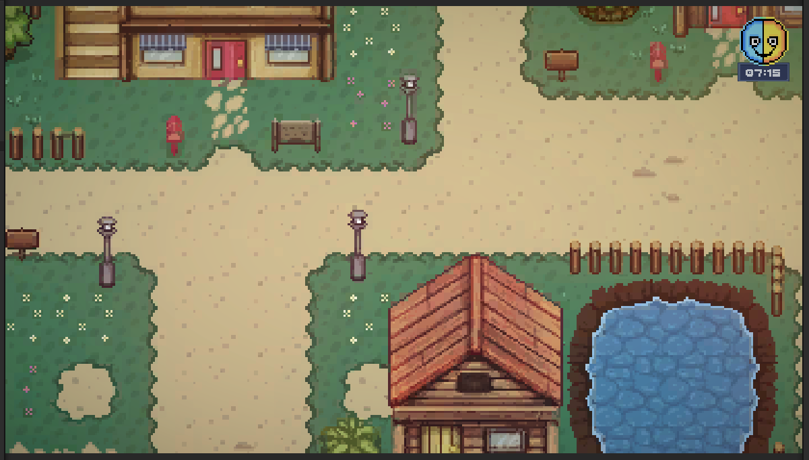
   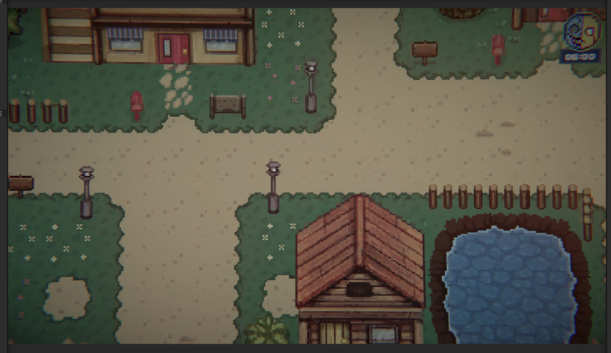

## Week 15 - Belzy and his house & Unity development

- 😈 **Beelzebub (Major Belzy)**
  - Sketched concept art for Beelzebub.
  - Finished top-down view of the character in 32x32

  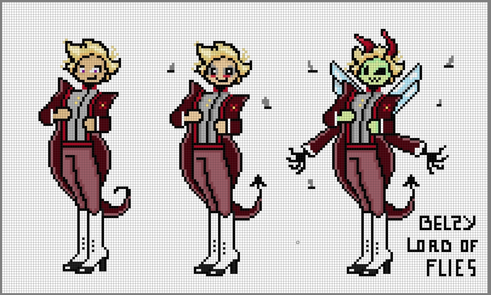
  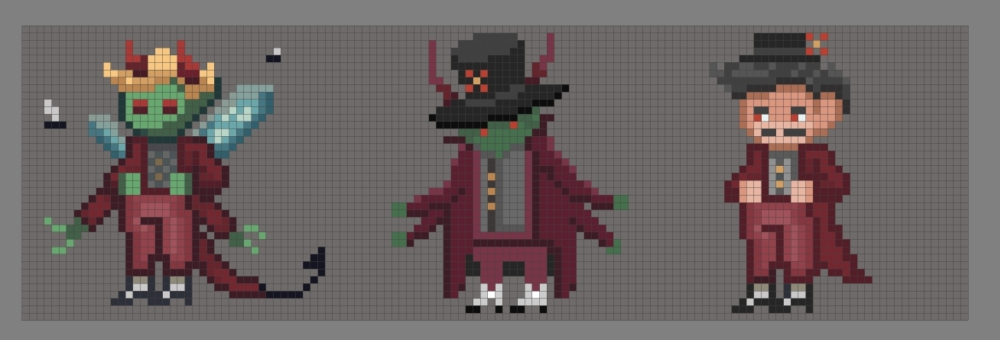
  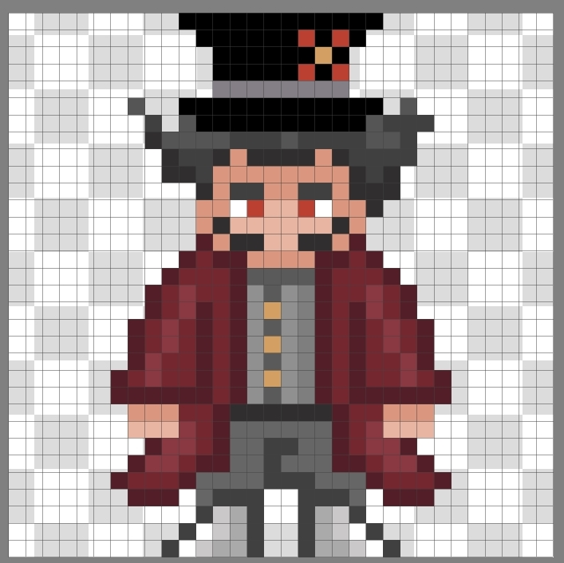
  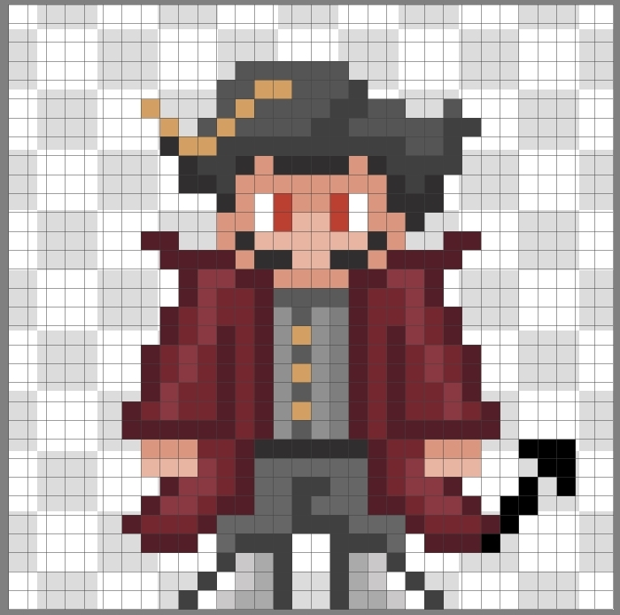
  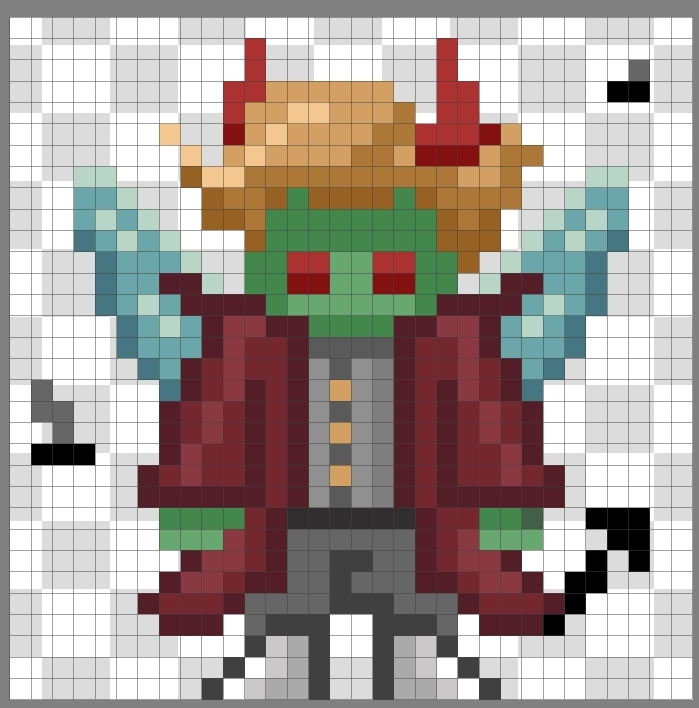
  
- 🧱 **Belzy's house**
  - Created the interior of the Major's house in Unity.
  - Created the interior of a banquet house. 
  - Started the interior of the sibling's house, but still in progress.
 

  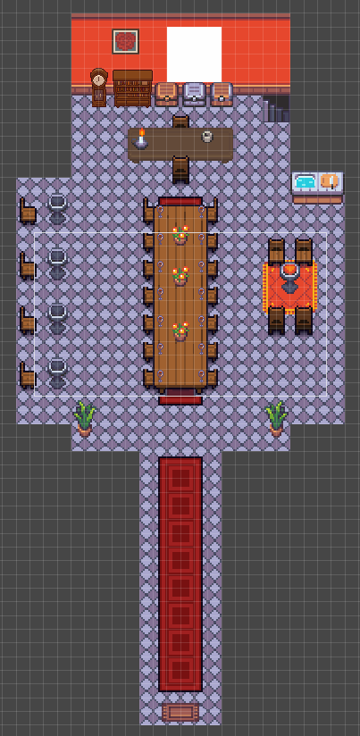
  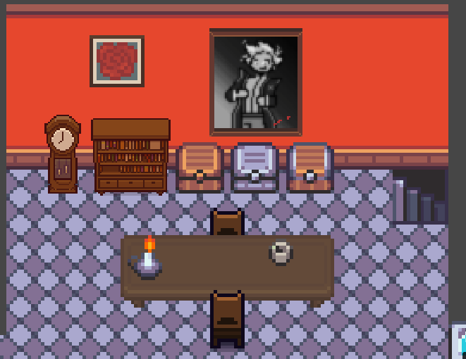
  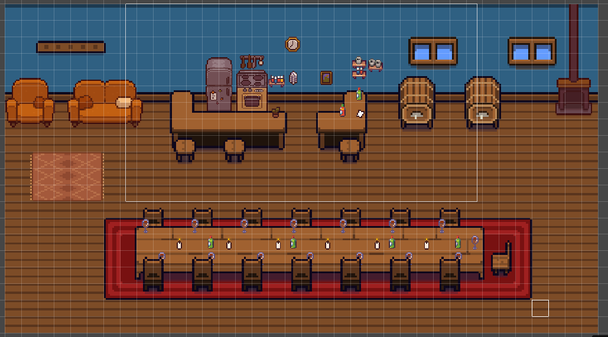
  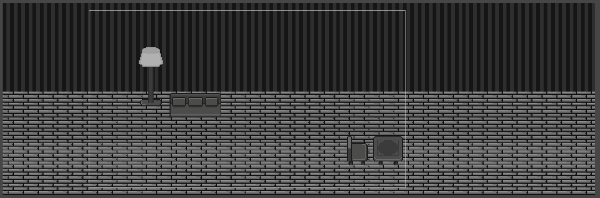

- 🧱 **Unity development**
  - Added player movement
  - Created scene management with fade in/out animations.
  - Created player spawn according to the entrance and exit of each scene.
  - Modified the player and time prefabs to make them consistent across scenes (singletons).
  - Uploaded project to GitHub. [Link to project here](https://github.com/HyperDecahedron/PoppyTown)

## Week 16 - Unity development & UI

- 🧱 **Unity development**
   - Finished logic for moving between scenes.
   - Added Cinemachine camera to follow the user and make it consistent across scenes.
   - Added map bounds.
   - Changed UI to a Canvas object so that it always stays on top of the screen.
   - Changed UI for the sun and added the moral meter with a white flower (good person) and a red flower (bad person).

   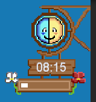

## Week 17 - Unity development & More visuals

- 🧱 **Unity development**
   - Implemented logic for the dialogs.
   - Added pixel perfect camera.
   - Added collisions to Mayor's House.
   - Implemented different step sounds according to the type of ground.
   - Implemented logic for interactable objects. 

 - 🖌️ **Visuals**
   - Created Delilah's animation
   - Created Belzy's animation in two stages of creepiness (human and half-human).
   - Polished Mayor's House and created two stages of creepiness.
   - Added lights.

## Week 18 – Diary System, Intro & Sound Design

- 🧱 **Unity development**
  - Finished the **intro scene** with glitch effects.
  - Created the **initial cutscene** that introduces the player to the story.
  - Implemented logic for **interactable objects** in the Mayor’s House so the player can approach and interact with them.
  - Built the logic for the **in-game diary system** with multiple tabs:
    1. Mary's diary  
    2. Possible endings  
    3. Controls overview  

- 🔊 **Sound Design**
  - Designed and added sound effects for:
    - Interactable objects  
    - Glitch effects in the intro  
    - Character-specific dialog sounds

- 🖌️ **Visuals**
  - Designed visuals for the diary UI.

---

## Week 19 – Dialog System & Character's Tasks

- 🧱 **Unity development**
  - Created a **prefab** for interactable objects with built-in animations and sound.
  - Implemented the complete **dialog and task system** for all characters, including:
    - Up to **12 dialog lines** per character.
    - **3 tasks**:
      1. **Dante** – Collect a watering can and poppy seeds  
      2. **Polina** – Clean the fountains  
      3. **Belzy** – Harvest 5 poppy seeds  
  - Added interactions across **Poppy Town** (candles, diary, newspapers, shovel).
  - Integrated **time-based changes** and **post-processing effects**.

- 🔊 **Sound & Music**
  - Added various **ambient sounds** and a **soundtrack** to enhance atmosphere.

- 🖌️ **Visual Feedback**
  - Polina now **changes the fountain sprite** before cleaning (sponge as interactable).
  - Implemented the **Moral Meter** logic based on player choices in dialogs.

   

