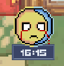

# DH2650 Individual DevLog 

Welcome to Natalia Sempere's DevLog! 🐱 
This is an individual development log for the course **DH2650 Computer Game Design** at KTH.  
It will serve as a diary, development updates and a media repository.  
Stay tuned for coming updates!  

  
27/03/2025 - Initial concepts

  - The first steps of the project have begun. We have decided to create a 2D pixel art game with a top-down perspective and a story-driven approach.
  - I have used a graphics tablet for the first time in my life and have drawn an initial character concept, in both plain 2D and pixel art. The three stages represent the evolution we plan to implement in the game.
    
  

  
04/04/2025 - Time and Sun animation

- 🧱 **Tile Map Investigation**
  - Researched how to generate tile maps in Unity.
  - Compared tile sizes (16px vs 32px).
  - **Decision:** Using 32px tiles for more details.

- ⏰ **Time Mechanic**
  - Implemented in-game time system.
  - 1 in-game day = 20 real-life minutes (configurable).

- 🌞🌙 **Day/Night Animation**
  - Drew and implemented an animation that displays a sun or moon based on the in-game time.

- 👻 **Creepiness Mechanic**
  - Implemented a "creepiness" level that updates every night at 03:00 in game time.

   
   
   
   

  
06/04/2025 - Postprocessing test

- 🎩 **Postprocessing progression**
  - Added postprocessing with URP and Global Volumes to the project. I'm using Unity 2022.3 and this was a nightmare that lasted the whole morning. Finally solved the problem with [this tutorial](https://www.youtube.com/watch?v=YDj-P1r-3ms&t=2s).
  - The postprocessing changes automatically according to the level of creepiness (from 1 to 3).
 
  
   
   

  
Week 15 - Belzy and his house

- 😈 **Beelzebub (Major Belzy)**
  - Sketched concept art for Beelzebub. The view for the top-down is still in progress.
 
- 🧱 **Belzy's house**
  - Created the interior of the Major's house in Unity. 
  - Started the interior of the sibling's house, but still in progress. 
 
  
   
   
   

